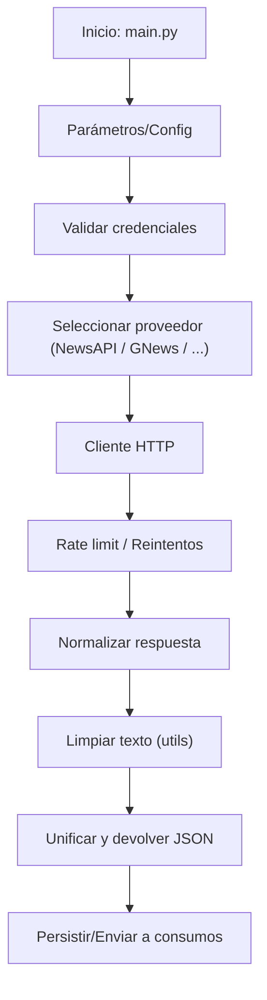

# 📰 InsightAI — Sistema de Análisis de Noticias con APIs Múltiples  
### PEP 8 · Ruff · Arquitectura Modular · Escalable

> Plataforma modular para recopilar, normalizar y analizar noticias desde múltiples APIs. Diseñada para facilitar la integración de nuevos proveedores, mantener calidad de código y permitir despliegues seguros.

---

[](https://www.python.org/)
[](https://github.com/charliermarsh/ruff)
[](https://opensource.org/licenses/MIT)
[](https://github.com/your-org/your-repo/actions)
[](https://pypi.org/)

ASCII Logo
```
	____        _        _   _   _   ___ 
 / ___|  __ _| |_ __ _| \ | | / | / _ \
| |  _  / _` | __/ _` |  \| | | || | | |
| |_| | (_| | || (_| | |\  | | || |_| |
 \____|\__,_|\__\__,_|_| \_| |_| \___/ 
InsightAI — News Multi-API Platform
```

---

## 🎯 Tabla de contenidos
- [Descripción General](#-descripción-general)
- [Características Principales](#-características-principales)
- [Arquitectura del Proyecto](#-arquitectura-del-proyecto)
- [Requisitos Previos](#-requisitos-previos)
- [Instalación](#-instalación)
- [Configuración Inicial](#-configuración-inicial)
- [Estructura del Proyecto](#-estructura-del-proyecto)
- [Ejecución](#-ejecución)
- [Scripts Disponibles](#-scripts-disponibles)
- [Guía de Uso / Ejemplos](#-guía-de-uso--ejemplos)
- [Diagrama de Flujo (Mermaid)](#diagrama-de-flujo-mermaid)
- [Troubleshooting](#-troubleshooting)
- [Buenas Prácticas para Producción](#-buenas-prácticas-para-producción)
- [Contribuciones](#-contribuciones)
- [Créditos y Licencia](#-créditos-y-licencia)

---

# 🌐 Descripción General

`InsightAI` es una base para construir pipelines de ingestión y análisis de noticias a partir de múltiples APIs públicas y privadas. Proporciona utilidades para:

- Conectar con distintos proveedores (NewsAPI, GNews, proveedores personalizados).
- Normalizar y limpiar contenido textual (remoción de HTML, normalización Unicode).
- Validar parámetros, credenciales y formatos de respuesta.
- Unificar resultados en un formato común para su posterior análisis o ingestión en modelos.

El repositorio está pensado para ser una plantilla extensible que respete estándares de calidad (PEP 8) y automatización (Ruff, CI).

---

# ✨ Características Principales

| Característica | Descripción |
|---|---|
| Modularidad | `news_analyzer` contiene el núcleo; `Examples/` contiene muestras y patrones. |
| Calidad | Linting con `ruff` y docstrings en español. |
| Escalabilidad | Diseño para añadir nuevos proveedores con clientes específicos. |
| Configuración segura | Soporta variables de entorno y archivos de credenciales. |
| Facilidad de uso | `main.py` como punto de entrada y ejemplos listos. |

---

# 🏗️ Arquitectura del Proyecto

Resumen conceptual:

- `main.py`: Entrada de ejecución, orquestador básico.
- `news_analyzer/`: Paquete principal con cliente(s) y utilidades.
- `Examples/`: Scripts de muestra y utilidades educativas.
- `pyproject.toml`: Metadata y configuración (instalación y herramientas).
- `README.md`: Documentación del proyecto.

Árbol simplificado:
```plaintext
📦 InsightAI-Multi-API-Platform
├── README.md
├── pyproject.toml
├── main.py
├── Examples/
│   ├── args_kwargs.py
│   ├── comprehensions.py
│   └── ...
└── news_analyzer/
		├── __init__.py
		├── api_client.py        # Clientes HTTP para proveedores
		├── config.py            # Carga y validación de configuración
		├── exceptions.py        # Excepciones custom
		├── open_ia.py           # Integración con servicios de IA (si aplica)
		└── utils.py             # Limpieza y normalización
```

---

# 📦 Requisitos Previos

Tabla de compatibilidad:

| Componente | Requisitos recomendados |
|---:|:---|
| Python | 3.10 — 3.12 |
| Sistema operativo | Windows, macOS, Linux (entornos POSIX recomendados para despliegue) |
| Herramientas | `python3`, `pip`, `virtualenv` o `venv`, `ruff` (opcional global) |
| CI/CD | GitHub Actions (archivo `.github/workflows/ci.yml` recomendado) |

> **Note:** Para desarrollo en Windows, usar PowerShell o WSL para una experiencia más cercana a POSIX.

---

# ⚙️ Instalación

A continuación se muestran pasos reproducibles para preparar el entorno:

1. Clonar el repositorio:
```bash
git clone https://github.com/your-org/your-repo.git
cd your-repo
```

2. Crear y activar un entorno virtual:

Windows (PowerShell):
```powershell
python -m venv .venv
.venv\\Scripts\\Activate.ps1
```

macOS / Linux:
```bash
python3 -m venv .venv
source .venv/bin/activate
```

3. Actualizar `pip` y luego instalar dependencias:

Si existe `requirements.txt`:
```bash
pip install --upgrade pip
pip install -r requirements.txt
```

Si se usa `pyproject.toml` (PEP 517/518):
```bash
pip install --upgrade pip
pip install .
# o para desarrollo editable
pip install -e .
```

4. Instalar `ruff` localmente en el entorno (opcional pero recomendado):
```bash
pip install ruff
```

---

# 🔧 Configuración Inicial

Variables y archivos de configuración:

- Variables de entorno (ejemplos):
	- `NEWSAPI_KEY` — API key para NewsAPI.
	- `GNEWS_KEY` — API key para GNews.
	- `OPENAI_API_KEY` — API key para OpenAI (si aplicas integraciones).
	- `ENV` — `development` / `production`

- Archivo de credenciales ejemplo:
	- Copiar el ejemplo y rellenar:
```bash
cp config/credentials_example.json config/credentials.json
```
Contenido esperado (`config/credentials_example.json`):
```json
{
	"newsapi_key": "tu_newsapi_key",
	"gnews_key": "tu_gnews_key",
	"openai_key": "tu_openai_key"
}
```

- Alternativa por variables de entorno (recomendado en producción):
```bash
export NEWSAPI_KEY="tu_key"
export GNEWS_KEY="tu_key"
export OPENAI_API_KEY="tu_key"
```

> **Warning:** Nunca subas `config/credentials.json` ni variables secretas a repositorios públicos. Usa `.gitignore` y gestores de secretos.

---

# 📁 Estructura del Proyecto (explicada)

- `main.py` — Punto de arranque; parsea argumentos y orquesta llamadas a `news_analyzer`.
- `news_analyzer/api_client.py` — Contiene la lógica para realizar solicitudes HTTP, manejo de rate limits y mapeo básico de respuestas.
- `news_analyzer/config.py` — Helpers para cargar config desde JSON o variables de entorno y validación.
- `news_analyzer/exceptions.py` — Excepciones específicas (p. ej. `CredentialsError`, `APIError`).
- `news_analyzer/open_ia.py` — Integración con servicios de IA, si se utiliza para enriquecimiento.
- `news_analyzer/utils.py` — Limpieza de texto, normalización, funciones compartidas.
- `Examples/` — Scripts demostrativos y snippets para pruebas y aprendizaje.

---

# 🚀 Ejecución

Modo desarrollo (ejecución local, con entorno activado):
```bash
python main.py --source newsapi --query "tecnología"
```

Ejemplo simple para probar un cliente:
```python
from news_analyzer.api_client import NewsApiClient

client = NewsApiClient(api_key=os.getenv("NEWSAPI_KEY"))
articles = client.fetch(q="IA", language="es", page_size=10)
print(len(articles), "artículos obtenidos")
```

Modo producción (recomendaciones):
- Ejecutar bajo un proceso manager (systemd, supervisord) o contenedor Docker.
- Configurar logging a archivo o a un colector (ELK/Graylog).
- Proteger credenciales mediante secretos del orquestador (Kubernetes Secrets, AWS Secrets Manager).

---

# 🧰 Scripts Disponibles

- Ejecutar el orquestador:
```bash
python main.py
```
- Lint / formato con `ruff`:
```bash
ruff check .
ruff format .
```
- Instalación:
```bash
pip install -r requirements.txt
# o
pip install -e .
```

(Si agrega `Makefile` o scripts en `pyproject.toml`, agregue aquí los comandos relevantes.)

---

# 🧭 Guía de Uso — Ejemplos

1. Buscar noticias por temática:
```bash
python main.py --source gnews --query "energías renovables" --limit 20
```

2. Ejecutar pipeline y guardar resultados en JSON:
```bash
python main.py --query "salud pública" --out results.json
```

3. Usar cliente desde REPL:
```python
from news_analyzer.api_client import GNewsClient

c = GNewsClient(api_key="...")
for a in c.fetch(q="economía", language="es"):
		print(a["title"])
```

---

# Diagrama de Flujo (Mermaid)



---

# 🛠️ Troubleshooting — Errores comunes y soluciones

- Error: "ModuleNotFoundError: No module named 'news_analyzer'"  
	- Solución: Asegúrate de que el entorno virtual está activado y el paquete instalado vía `pip install -e .` o ejecuta `python -m` desde la raíz del repo.

- Error: "401 Unauthorized" o credenciales inválidas  
	- Solución: Verifica `NEWSAPI_KEY`/`GNEWS_KEY` y que no excediste límites. Usa `config/credentials_example.json` o variables de entorno.

- Error: `JSONDecodeError` al parsear respuesta  
	- Solución: Revisa el contenido bruto de la respuesta (posible error de la API). Añade logs y valida `response.status_code`.

- Problemas con `ruff` (faltan reglas o versión)  
	- Solución: Instala `ruff` localmente: `pip install ruff` y ejecuta `ruff check .` para ver detalles.

> **Tip:** Para depurar habilita logging DEBUG (temporal) y registra `response.text` de las llamadas HTTP cuando fallan.

---

# ✅ Buenas prácticas / Recomendaciones para producción

- No incluir credenciales en el repo; usar gestores de secretos.
- Separar entornos: `development`, `staging`, `production`.
- Hacer monitorización de errores y métricas (latencia, tasa de fallos, número de artículos por fuente).
- Implementar backoff exponencial y manejo de rate limits en `api_client.py`.
- Pruebas unitarias para parsers y normalizadores; tests de integración con mocks para APIs externas.
- Contenerizar la aplicación con `Dockerfile` y orquestar con Kubernetes o servicio gestionado.
- Usar CI (GitHub Actions) para ejecutar `ruff` y tests automáticamente.

---

# 🤝 Contribuciones

- Forkea el repositorio.
- Crea una rama descriptiva `feature/mi-nuevo-proveedor`.
- Añade pruebas y actualiza la documentación.
- Abre un Pull Request describiendo los cambios.

Contribuciones están sujetas a revisión; mantenemos un código limpio y con tests.

---

# 📜 Créditos y Licencia

- Autor: Platzi / Contribuidores.
- Inspiración: plantillas y buenas prácticas open-source.

---


